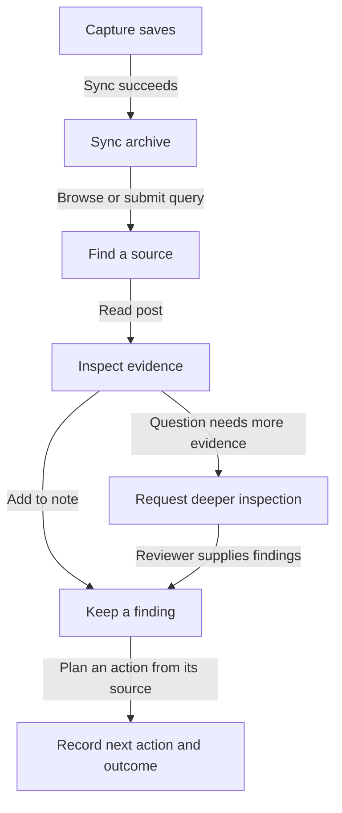
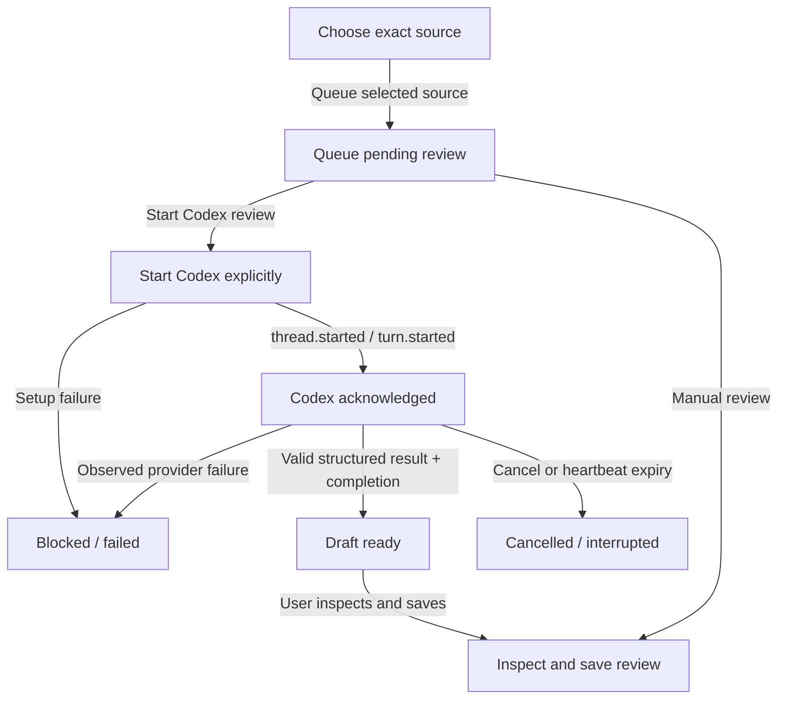
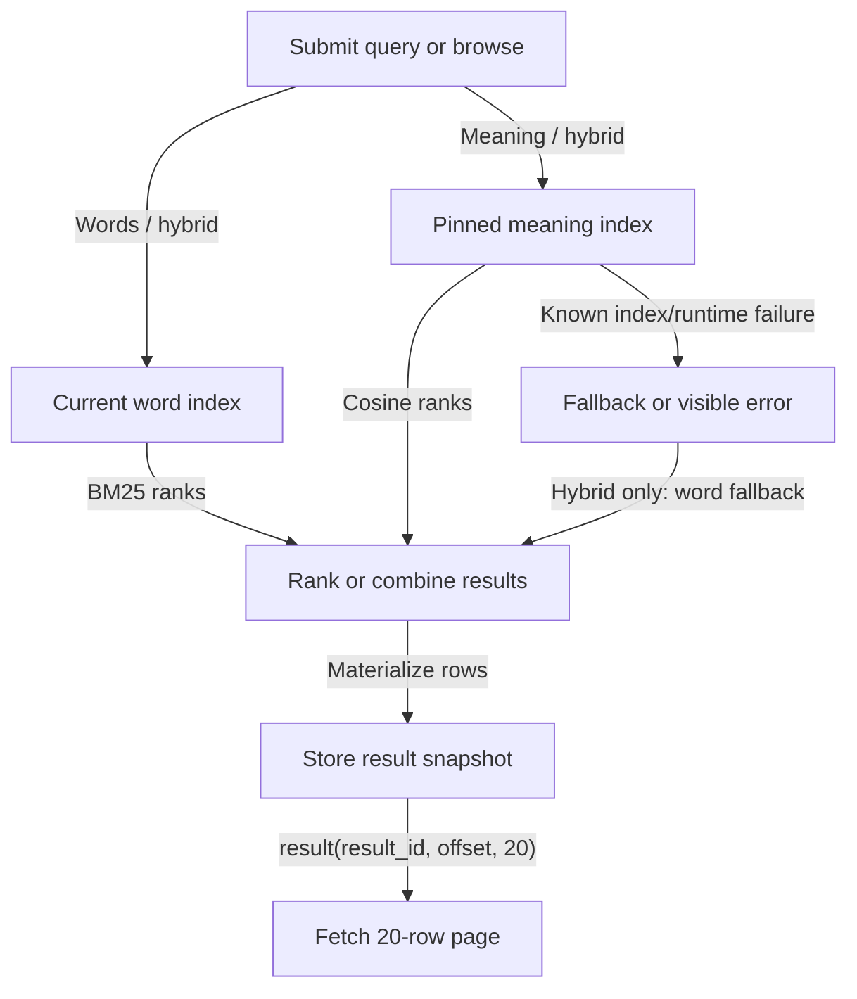
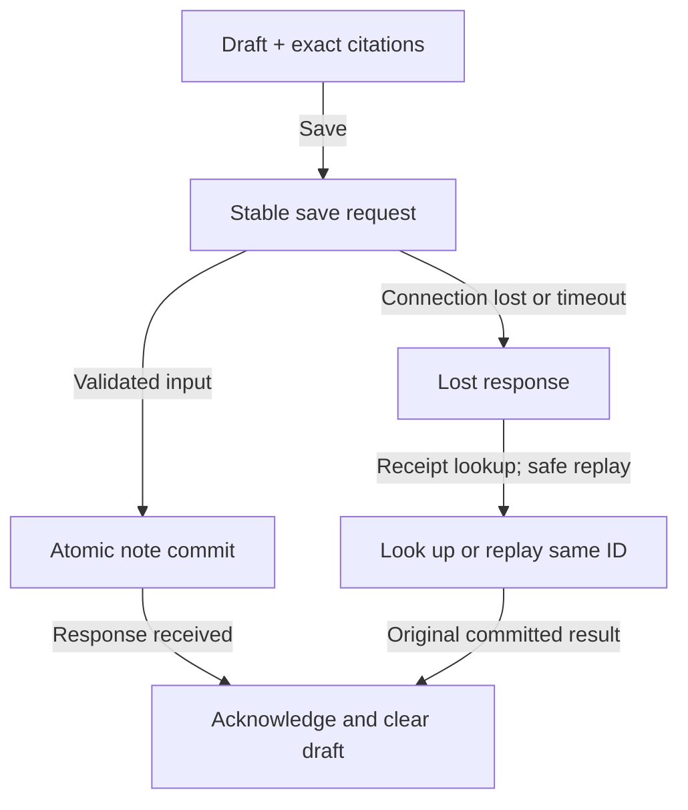
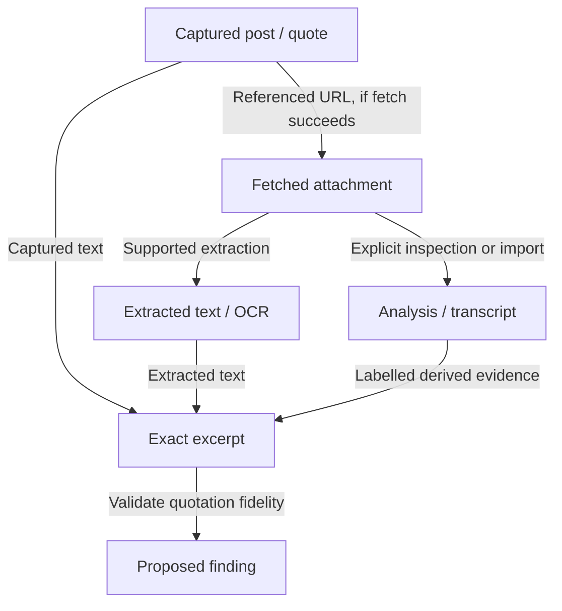
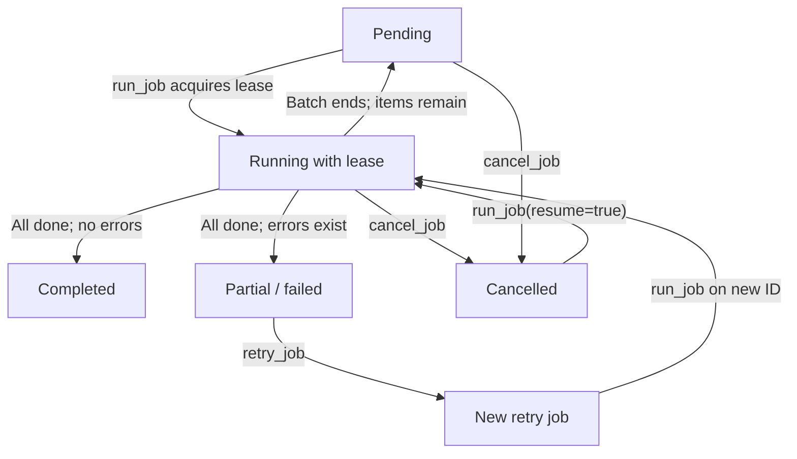
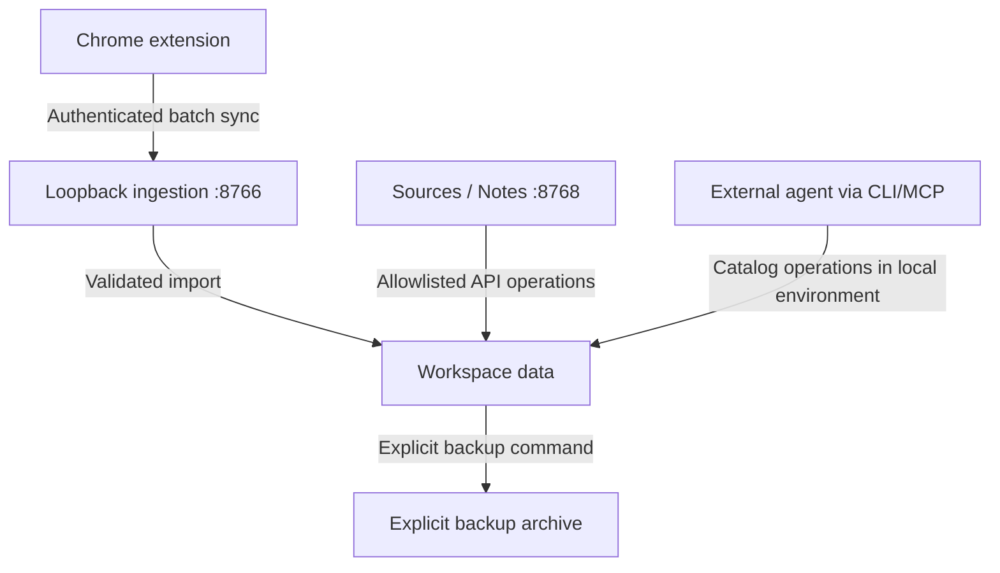
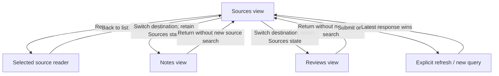

# Inside the inator — visual specification

Sources/Notes UI plus its capture, evidence, job and storage boundaries. Code inspection with linked regression tests; not a claim that every behavior has been browser-tested or that every historical design rationale is known.

Generated from `scripts/build_visual_spec.py`. Regenerate with `python scripts/build_visual_spec.py`; detect drift with `python scripts/build_visual_spec.py --check`. The interactive companion is [visual-spec.html](visual-spec.html).

Implemented = observed in code. Proposed = not shipped. Unknown = missing observation or rationale. A linked test is relevant coverage, not proof of the entire rule.

## System maps

### From saving to using

What does the app help a person finish?

**Gap:** Reasons and outcomes are authored by the person. One action is stored per captured source version; reminders are not scheduled automatically.

- **Capture saves** — owner: Person + extension; retained state: Browser library; decisions: D01, D02, D03
- **Sync archive** — owner: Extension + bridge; retained state: Immutable observations; decisions: D04, D05, D06
- **Find a source** — owner: Person + local server; retained state: Result snapshot; decisions: D08, D09, D12
- **Inspect evidence** — owner: Person; retained state: Selection in this page; decisions: D25, D28, D29
- **Keep a finding** — owner: Person + local server; retained state: Investigation + artifact; decisions: D30, D32, D33
- **Request deeper inspection** — owner: Person + external reviewer; retained state: Pending media request; decisions: D38, D39, D40
- **Record next action and outcome** — owner: Person + local server; retained state: Source-linked action and outcome; decisions: D61

### Review queue and tracked execution

What is actually happening after Request review?

**Gap:** Only runs started here are observable. Audio/video cannot be inferred from a thumbnail; unsupported or insufficient evidence is reported in the draft.

- **Choose exact source** — owner: Person; retained state: Selected observation ID; decisions: D38, D63
- **Queue pending review** — owner: Server; retained state: Media request + receipt; decisions: D39
- **Start Codex explicitly** — owner: Person + local worker; retained state: Run ID; decisions: D40, D66
- **Codex acknowledged** — owner: Codex process; retained state: Heartbeat + last activity; decisions: D62
- **Blocked / failed** — owner: Worker; retained state: Persistent error and retry path; decisions: D45, D62
- **Draft ready** — owner: Codex + worker; retained state: Unpublished draft; decisions: D40, D62
- **Inspect and save review** — owner: Person + server; retained state: Atomic evidence + completion receipt; decisions: D41, D42, D64
- **Cancelled / interrupted** — owner: Person / heartbeat monitor; retained state: Terminal attempt; late result ignored; decisions: D62

### Search has two evidence clocks

Which data can this query see?

**Gap:** New evidence can still predate the meaning index. Activity offers a tracked rebuild. Fixture latency budgets do not establish personal-library relevance.

- **Submit query or browse** — owner: Browser; retained state: Query draft; decisions: D08, D18
- **Current word index** — owner: Local server; retained state: Revision-sensitive memory cache; decisions: D09, D10, D11
- **Pinned meaning index** — owner: Local model + server; retained state: Immutable index on disk; decisions: D12, D13, D17
- **Rank or combine results** — owner: Local server; retained state: Word, semantic or fused ranking; decisions: D14, D15, D16
- **Store result snapshot** — owner: Local server; retained state: SQLite result ID; decisions: D07
- **Fetch 20-row page** — owner: Browser + server; retained state: Stable paging cursor; decisions: D19, D20
- **Fallback or visible error** — owner: Browser + server; retained state: No implied semantic success; decisions: D16, D44, D45

### A save can have an unknown outcome

What survives a failed or interrupted save?

**Gap:** not_found is not proof that an in-flight write failed. An unchanged retry uses the same ID; newer edits reconcile the old submission first.

- **Draft + exact citations** — owner: Person + browser; retained state: Session storage; decisions: D30, D31
- **Stable save request** — owner: Browser; retained state: Request ID + immutable submitted input; decisions: D36, D64
- **Atomic note commit** — owner: Server; retained state: Investigation + artifact + receipt; decisions: D32, D33
- **Acknowledge and clear draft** — owner: Browser; retained state: Saved note; decisions: D36
- **Lost response** — owner: Browser; retained state: Draft and request retained; decisions: D44, D46
- **Look up or replay same ID** — owner: Browser + server; retained state: One committed result; decisions: D46, D64

### Evidence is not interpretation

What can a displayed finding legitimately claim?

**Gap:** Exact quotation validation does not establish semantic support. Unfetched, untranscribed and visually uninspected material stays outside known coverage.

- **Captured post / quote** — owner: Collector + import; retained state: Immutable source observation; decisions: D06
- **Fetched attachment** — owner: Enrichment worker; retained state: Separate resource observation; decisions: D10, D54
- **Extracted text / OCR** — owner: Extractor; retained state: Derived text with coverage; decisions: D13, D28
- **Analysis / transcript** — owner: Person / external agent; retained state: Separate derived resource; decisions: D40, D41
- **Exact excerpt** — owner: Retrieval + citation validator; retained state: Observation + field + offsets; decisions: D26, D30, D33
- **Proposed finding** — owner: Person / agent; retained state: Artifact with evidence links; decisions: D33, D35, D37

### Background job state machine

How do partial work, retries and cancellation behave?

**Gap:** These are local enrichment jobs. They are not Codex agent runs, and this state machine is not exposed in the Sources/Notes UI.

- **Pending** — owner: CLI / MCP caller; retained state: Job payload + cursor; decisions: D47
- **Running with lease** — owner: Bounded worker; retained state: Lease + item checkpoints; decisions: D48
- **Completed** — owner: Worker; retained state: All items processed without error; decisions: D49
- **Partial / failed** — owner: Worker; retained state: Results and error list; decisions: D49
- **Cancelled** — owner: Explicit caller; retained state: Completed evidence retained; decisions: D50
- **New retry job** — owner: Explicit caller; retained state: Failed items copied to new job; decisions: D50

### Storage and execution boundaries

Where does data live, and who can act on it?

**Gap:** Local retrieval is not a promise that an external agent stays local. What an external agent sends to its provider depends on that agent; this app does not observe it.

- **Chrome extension** — owner: User browser; retained state: Browser-local library + preferences; decisions: D01, D04, D59
- **Loopback ingestion :8766** — owner: Python bridge; retained state: Pairing token + imports; decisions: D05
- **Workspace data** — owner: Local filesystem / SQLite; retained state: Observations, blobs, notes, jobs, results; decisions: D06, D07, D55
- **Sources / Notes :8768** — owner: Local web app; retained state: Transient view state + draft; decisions: D51, D52, D53
- **External agent via CLI/MCP** — owner: User-selected agent; retained state: Agent-owned execution context; decisions: D40, D47, D51
- **Explicit backup archive** — owner: User-run backup script; retained state: SQLite snapshot + evidence; no token; decisions: D55

### View and reader lifecycle

What changes when you switch destinations?

**Gap:** Polling shows committed external updates without replacing the reader. Accepting refresh preserves selection and scroll. Remote source changes still require capture.

- **Sources view** — owner: Browser; retained state: Cached list + query draft; decisions: D08, D21, D23
- **Selected source reader** — owner: Browser; retained state: Selection + previous scroll/focus; decisions: D25, D27, D57
- **Notes view** — owner: Browser; retained state: Cached latest-artifact results; decisions: D21, D37
- **Reviews view** — owner: Browser; retained state: Cached request results; decisions: D21, D22, D39
- **Explicit refresh / new query** — owner: Browser; retained state: New result ID; source selection clears; decisions: D18, D19, D22

## Decision register

### D01 · Capture is explicitly enabled

Only eligible X history traffic is observed while collection is enabled.

**Consequence:** A saved library is not proof that the entire historical account was collected.

**Acceptance example:** Pause collection; a response that was already in flight must not add posts.

**Code:** [extension/network.js:10](../extension/network.js#L10)
**Related test:** [pause discards responses](../tests/network.test.cjs#L24)

Historical rationale not established by this audit; consequence is analysis of the current behavior.

### D02 · Identity includes the account

Normalized keys distinguish the same post saved by different owners.

**Consequence:** Merging accounts would lose who saved what.

**Acceptance example:** Capture the same post for two owners; retain two distinct keys.

**Code:** [extension/core.js:17](../extension/core.js#L17)
**Related test:** [same post in two accounts](../tests/core.test.cjs#L33)

Historical rationale not established by this audit; consequence is analysis of the current behavior.

### D03 · Recapture merges evidence

Recapture can improve text and media while preserving review decisions.

**Consequence:** Capturing again should not erase a human classification.

**Acceptance example:** Recapture a reviewed post; confirmed and rejected reasons survive.

**Code:** [extension/core.js:43](../extension/core.js#L43)
**Related test:** [recapture merges](../tests/core.test.cjs#L15)

Historical rationale not established by this audit; consequence is analysis of the current behavior.

### D04 · Sync is a separate operation

The extension sends local posts in batches of 200 to the authenticated bridge.

**Consequence:** Browser storage and the workspace can disagree until sync succeeds.

**Acceptance example:** An unavailable bridge produces a saved sync error, not a successful sync status.

**Code:** [extension/workspace-sync.js:4](../extension/workspace-sync.js#L4)
**Related test:** [workspace sync sends every post](../tests/workspace-sync.test.cjs#L16)

Historical rationale not established by this audit; consequence is analysis of the current behavior.

### D05 · Ingestion is authenticated

The bridge accepts backup ingestion on loopback with a pairing token.

**Consequence:** Pairing authorizes ingestion; it is not permission to execute arbitrary commands.

**Acceptance example:** A request without the token is rejected.

**Code:** [gold_workspace/bridge.py:22](../gold_workspace/bridge.py#L22)
**Related test:** [def test_authentication](../tests/test_bridge.py#L4)

Historical rationale not established by this audit; consequence is analysis of the current behavior.

### D06 · Import is validated and versioned

Imports validate identities and retain immutable observations; repeated backup content is idempotent.

**Consequence:** New captures create versions rather than rewriting old citation targets.

**Acceptance example:** Import the same backup twice; the second import adds no versions.

**Code:** [gold_workspace/engine.py:49](../gold_workspace/engine.py#L49)
**Related test:** [def test_idempotent](../tests/test_workspace.py#L13)

Historical rationale not established by this audit; consequence is analysis of the current behavior.

### D07 · Snapshots and results are stable

Search results are materialized in SQLite under result IDs.

**Consequence:** Later imports do not change pages belonging to an existing result set.

**Acceptance example:** Import new content between pages; the old result ID still returns its original rows.

**Code:** [gold_workspace/engine.py:113](../gold_workspace/engine.py#L113)
**Related test:** [def test_snapshots](../tests/test_workspace.py#L19)

Historical rationale not established by this audit; consequence is analysis of the current behavior.

### D08 · Browse has a defined order

Empty search text browses current posts by posted date descending, with undated posts last.

**Consequence:** Browse is chronological, not ranked by relevance or save date.

**Acceptance example:** An undated post follows dated posts; semantic inference is not called.

**Code:** [gold_workspace/research.py:53](../gold_workspace/research.py#L53)
**Related test:** [def test_browse](../tests/test_research.py#L21)

Historical rationale not established by this audit; consequence is analysis of the current behavior.

### D09 · Word matching is token based

Unicode word tokens are case-folded; a query can match any query term, ranked by BM25.

**Consequence:** Words only is neither exact phrase matching nor an all-words requirement.

**Acceptance example:** A two-term query may return a source containing only one term.

**Code:** [gold_workspace/research.py:68](../gold_workspace/research.py#L68)
**Verification:** code inspection; no specific automated test mapped in this register.

Historical rationale not established by this audit; consequence is analysis of the current behavior.

### D10 · Word search includes captured evidence

Search includes post text, context, quotes and extracted attachment text, deduplicating identical source text within a document.

**Consequence:** Unfetched pages and uninterpreted pixels cannot contribute text matches.

**Acceptance example:** An imported transcript phrase becomes a word match.

**Code:** [gold_workspace/research.py:15](../gold_workspace/research.py#L15)
**Verification:** code inspection; no specific automated test mapped in this register.

Historical rationale not established by this audit; consequence is analysis of the current behavior.

### D11 · Warm word data is shared

A bounded process cache reuses token counts and postings across HTTP connections; revisions and attachment relationships invalidate it.

**Consequence:** First load and changed evidence still require preparation. Separate CLI processes do not share it.

**Acceptance example:** Two connections searching unchanged data construct the corpus once; import then rebuilds it.

**Code:** [gold_workspace/research.py:19](../gold_workspace/research.py#L19)
**Related test:** [def test_queries_reuse](../tests/test_research.py#L112)

Historical rationale not established by this audit; consequence is analysis of the current behavior.

### D12 · Meaning search uses a pinned index

Local passage search uses an immutable attachment index selected by a pointer or explicit ID.

**Consequence:** A valid meaning index may omit evidence captured after it was built.

**Acceptance example:** New evidence changes word search immediately but does not silently alter an old semantic index.

**Code:** [gold_workspace/attachment_search.py:113](../gold_workspace/attachment_search.py#L113)
**Related test:** [def test_shared_attachment](../tests/test_attachment_search.py#L64)

Historical rationale not established by this audit; consequence is analysis of the current behavior.

### D13 · Passages have bounded overlap

Indexing covers cleaned text in 120-word windows with 30-word overlap and exact original spans.

**Consequence:** Cleaning affects matching, not the original quoted evidence.

**Acceptance example:** A phrase near the end of a long document remains represented.

**Code:** [gold_workspace/attachment_search.py:44](../gold_workspace/attachment_search.py#L44)
**Related test:** [def test_full_document](../tests/test_research.py#L38)

Historical rationale not established by this audit; consequence is analysis of the current behavior.

### D14 · Meaning scores do not prove truth

Parent ranking uses maximum passage cosine and up to three distinct supporting excerpt texts.

**Consequence:** Similarity is a retrieval signal, not a confidence or truth score.

**Acceptance example:** Shared attachment evidence does not multiply a parent score.

**Code:** [gold_workspace/attachment_search.py:147](../gold_workspace/attachment_search.py#L147)
**Verification:** code inspection; no specific automated test mapped in this register.

Historical rationale not established by this audit; consequence is analysis of the current behavior.

### D15 · Hybrid combines ranks

Words + meaning adds reciprocal ranks with k=60; ties use observation ID.

**Consequence:** The displayed order does not use a learned reranker.

**Acceptance example:** A source present in both ranked lists receives both reciprocal-rank contributions.

**Code:** [gold_workspace/research.py:99](../gold_workspace/research.py#L99)
**Verification:** code inspection; no specific automated test mapped in this register.

Historical rationale not established by this audit; consequence is analysis of the current behavior.

### D16 · Hybrid failure degrades explicitly

Known model, filesystem and index errors fall back to lexical results in hybrid mode; semantic-only mode raises the error.

**Consequence:** A word-only result is useful, but must not be called successful meaning search.

**Acceptance example:** Make model assets unreadable; hybrid returns word results and a fallback receipt.

**Code:** [gold_workspace/research.py:92](../gold_workspace/research.py#L92)
**Related test:** [def test_unreadable_model](../tests/test_research.py#L134)

Historical rationale not established by this audit; consequence is analysis of the current behavior.

### D17 · Semantic data is cached

Up to two indexes are reused; NumPy scores normalized matrices when available.

**Consequence:** Cold JSON loading and model initialization remain different from warm scoring.

**Acceptance example:** Search through two workspace connections; unchanged index data is loaded once.

**Code:** [gold_workspace/attachment_search.py:16](../gold_workspace/attachment_search.py#L16)
**Related test:** [def test_index_is_reused](../tests/test_attachment_search.py#L25)

Historical rationale not established by this audit; consequence is analysis of the current behavior.

### D18 · Search replaces the visible list

Submitting a query clears the previous list and reader, then retrieves a result ID and a first page.

**Consequence:** A failed new search does not leave the old results visible as if they answered it.

**Acceptance example:** Submit a new query while reading; selection clears and pending feedback appears.

**Code:** [gold_workspace/web/app.js:330](../gold_workspace/web/app.js#L330)
**Related test:** [Browse all clears](../tests/workspace-ui.test.cjs#L200)

Historical rationale not established by this audit; consequence is analysis of the current behavior.

### D19 · Late responses are ignored

Generation tickets and result IDs prevent an older request from replacing a newer view.

**Consequence:** Ignoring a response does not cancel server work.

**Acceptance example:** An old query finishes last; the newer query remains on screen.

**Code:** [gold_workspace/web/app.js:324](../gold_workspace/web/app.js#L324)
**Related test:** [a late search response](../tests/workspace-ui.test.cjs#L133)

Historical rationale not established by this audit; consequence is analysis of the current behavior.

### D20 · Pages contain 20 rows

The UI loads 20 rows at a time from a stable result ID.

**Consequence:** Loaded count and total count have different meanings.

**Acceptance example:** Load more appends rows and continues ordinals.

**Code:** [gold_workspace/web/app.js:323](../gold_workspace/web/app.js#L323)
**Related test:** [result ordinals](../tests/workspace-ui.test.cjs#L156)

Historical rationale not established by this audit; consequence is analysis of the current behavior.

### D21 · Tabs preserve local state

Tabs retain results, query drafts, scroll and the selected source. A five-second status poll offers updates without replacing them.

**Consequence:** Refresh is explicit; the update action preserves the selected source reader and reading position.

**Acceptance example:** Detect external evidence while reading; the reader stays selected.

**Code:** [gold_workspace/web/app.js:624](../gold_workspace/web/app.js#L624)
**Related test:** [Polling notices external evidence](../scripts/check_workflows.cjs#L49)

Historical rationale not established by this audit; consequence is analysis of the current behavior.

### D22 · Refresh is explicit

Status polling compares source, note, review and action tokens and offers a refresh notice.

**Consequence:** The app observes committed local changes; it does not infer remote source changes.

**Acceptance example:** Complete a review externally; show an update notice without replacing the reader.

**Code:** [gold_workspace/web/app.js:597](../gold_workspace/web/app.js#L597)
**Related test:** [Polling notices external evidence](../scripts/check_workflows.cjs#L49)

Historical rationale not established by this audit; consequence is analysis of the current behavior.

### D23 · URLs identify destinations

Sources, Notes, Reviews and Actions have hash destinations and browser Back support.

**Consequence:** Individual records still do not have dedicated deep links.

**Acceptance example:** Open #actions directly and navigate Back.

**Code:** [gold_workspace/web/app.js:412](../gold_workspace/web/app.js#L412)
**Related test:** [destination links](../tests/workspace-ui.test.cjs#L210)

Historical rationale not established by this audit; consequence is analysis of the current behavior.

### D24 · Scan and Read reuse results

Changing density alters presentation without retrieving again; preference uses localStorage.

**Consequence:** Layout preference survives when browser storage is available.

**Acceptance example:** Toggle Scan/Read and verify zero API calls.

**Code:** [gold_workspace/web/app.js:21](../gold_workspace/web/app.js#L21)
**Related test:** [changing Scan/Read](../tests/workspace-ui.test.cjs#L145)

Historical rationale not established by this audit; consequence is analysis of the current behavior.

### D25 · Reading preserves full post text

Cards bound post text at 600 characters; the reader uses the full captured post.

**Consequence:** Full captured post text is not necessarily the complete original remote post.

**Acceptance example:** Open a long source; the reader retains the tail.

**Code:** [gold_workspace/web/app.js:148](../gold_workspace/web/app.js#L148)
**Verification:** code inspection; no specific automated test mapped in this register.

Historical rationale not established by this audit; consequence is analysis of the current behavior.

### D26 · Excerpts and citations differ

The match preview is bounded at 360 characters; stored evidence retains its exact quote and offsets.

**Consequence:** A shortened visual preview must not become the citation text.

**Acceptance example:** Add a long excerpt to a note; the citation retains the full source span.

**Code:** [gold_workspace/web/app.js:156](../gold_workspace/web/app.js#L156)
**Verification:** code inspection; no specific automated test mapped in this register.

Historical rationale not established by this audit; consequence is analysis of the current behavior.

### D27 · Scan hides secondary actions

In the Sources scan layout, evidence and actions other than Read post are hidden by CSS.

**Consequence:** Keeping evidence and requesting a review requires opening the reader or changing layout.

**Acceptance example:** Open Read post from Scan to reveal the source actions.

**Code:** [gold_workspace/web/app.css:1597](../gold_workspace/web/app.css#L1597)
**Verification:** code inspection; no specific automated test mapped in this register.

Historical rationale not established by this audit; consequence is analysis of the current behavior.

### D28 · Evidence kinds are labelled

The UI distinguishes post text, linked pages, OCR, thumbnail OCR, transcripts and interpretation.

**Consequence:** A thumbnail does not establish what happens in the full video.

**Acceptance example:** Thumbnail OCR receives an explicit thumbnail-only label.

**Code:** [gold_workspace/web/app.js:107](../gold_workspace/web/app.js#L107)
**Related test:** [thumbnail OCR](../tests/workspace-ui.test.cjs#L167)

Historical rationale not established by this audit; consequence is analysis of the current behavior.

### D29 · Missing information is explicit

Missing post text, absent dates and unavailable excerpts receive explanatory copy.

**Consequence:** Absence of captured information does not prove that the source has no such content.

**Acceptance example:** An undated record says Date unavailable.

**Code:** [gold_workspace/web/app.js:176](../gold_workspace/web/app.js#L176)
**Verification:** code inspection; no specific automated test mapped in this register.

Historical rationale not established by this audit; consequence is analysis of the current behavior.

### D30 · Citations are exact source spans

Add to note collects supporting spans, deduplicated by observation, field and offsets; citations can be removed.

**Consequence:** A note may combine evidence from several results.

**Acceptance example:** Add the same span twice; retain one citation.

**Code:** [gold_workspace/web/app.js:130](../gold_workspace/web/app.js#L130)
**Verification:** code inspection; no specific automated test mapped in this register.

Historical rationale not established by this audit; consequence is analysis of the current behavior.

### D31 · Draft storage is tab scoped

Title, body, citations and pending investigation ID are stored in sessionStorage when available.

**Consequence:** Reload recovery is not durable backup; another device or closed session may not retain it.

**Acceptance example:** Reload the same session and recover a draft; storage failure leaves editing usable.

**Code:** [gold_workspace/web/app.js:112](../gold_workspace/web/app.js#L112)
**Verification:** code inspection; no specific automated test mapped in this register.

Historical rationale not established by this audit; consequence is analysis of the current behavior.

### D32 · A note save is atomic

save_note commits investigation, artifact and stable request receipt in one transaction.

**Consequence:** A lost acknowledgment can be reconciled and replayed without duplicating the note.

**Acceptance example:** Drop the response after commit; one note exists and its receipt resolves.

**Code:** [gold_workspace/workflows.py:38](../gold_workspace/workflows.py#L38)
**Related test:** [def test_atomic_note_replay](../tests/test_workflows.py#L28)

Historical rationale not established by this audit; consequence is analysis of the current behavior.

### D33 · Citation fidelity is validated

Claims verify the exact source field, offsets and quote before writing an artifact version.

**Consequence:** Quotation fidelity does not establish that the source supports the conclusion.

**Acceptance example:** A changed quote is rejected, even when the observation ID is valid.

**Code:** [gold_workspace/engine.py:209](../gold_workspace/engine.py#L209)
**Related test:** [def test_claim_span](../tests/test_workspace.py#L37)

Historical rationale not established by this audit; consequence is analysis of the current behavior.

### D34 · Versions prevent blind overwrites

Artifact writes check expected_version and append a new version.

**Consequence:** Conflicting edits require reconciliation rather than last-writer-wins.

**Acceptance example:** Reuse an obsolete version; receive a conflict.

**Code:** [gold_workspace/engine.py:196](../gold_workspace/engine.py#L196)
**Related test:** [def test_claim_span](../tests/test_workspace.py#L37)

Historical rationale not established by this audit; consequence is analysis of the current behavior.

### D35 · UI note states remain qualified

Uncited notes are unverified; cited notes are proposed after exact-span validation.

**Consequence:** Citations do not establish truth automatically.

**Acceptance example:** Inspect the stored status of a cited and an uncited note.

**Code:** [gold_workspace/workflows.py:38](../gold_workspace/workflows.py#L38)
**Verification:** code inspection; no specific automated test mapped in this register.

Historical rationale not established by this audit; consequence is analysis of the current behavior.

### D36 · Saving locks the editor

During save, the button, editor and citation controls are locked; failure restores them and retains the draft.

**Consequence:** A user cannot edit the submitted draft while its request is pending.

**Acceptance example:** A returned usage error leaves the draft intact and Save enabled.

**Code:** [gold_workspace/web/app.js:425](../gold_workspace/web/app.js#L425)
**Related test:** [failed note saves](../tests/workspace-ui.test.cjs#L261)

Historical rationale not established by this audit; consequence is analysis of the current behavior.

### D37 · Research is separate from sources

Research search returns latest artifact versions and flags changed captured evidence.

**Consequence:** Newer archive content and changed cited evidence are distinct warnings.

**Acceptance example:** Recapture a cited source; the finding displays the changed-source warning.

**Code:** [gold_workspace/research.py:105](../gold_workspace/research.py#L105)
**Related test:** [def test_research_versions](../tests/test_research.py#L46)

Historical rationale not established by this audit; consequence is analysis of the current behavior.

### D38 · The person selects the review target

Review and coverage opens an explicit source/attachment selector with no default selection.

**Consequence:** Missing attachments must be captured before they can be reviewed; displayed previews identify the target.

**Acceptance example:** Choose attachment B among multiple references; the submitted observation is B.

**Code:** [gold_workspace/web/app.js:489](../gold_workspace/web/app.js#L489)
**Related test:** [await page.selectOption('#media-target','2')](../scripts/check_workflows.cjs#L26)

Historical rationale not established by this audit; consequence is analysis of the current behavior.

### D39 · Queueing is durable, not execution

queue_review records a pending request with a replayable receipt. Starting Codex is a separate explicit action.

**Consequence:** Queueing still does not silently spend agent usage.

**Acceptance example:** Queue a source, then start one tracked run explicitly.

**Code:** [gold_workspace/workflows.py:51](../gold_workspace/workflows.py#L51)
**Related test:** [def test_review_completion](../tests/test_workflows.py#L51)

Historical rationale not established by this audit; consequence is analysis of the current behavior.

### D40 · Tracked agent execution is observable

Runs started here use the local Codex CLI and persist actual acknowledgment, failures, heartbeat and draft results.

**Consequence:** Externally started agents remain unobserved. Missing sign-in and quota failures are blocked states, not silent pending work.

**Acceptance example:** A provider quota failure persists as blocked across page reload.

**Code:** [gold_workspace/runner.py:88](../gold_workspace/runner.py#L88)
**Related test:** [def test_worker_persists_provider_failure](../tests/test_workflows.py#L93)

Historical rationale not established by this audit; consequence is analysis of the current behavior.

### D41 · Accepted drafts become derived evidence

save_review atomically commits derived evidence, completion, annotation and request receipt. Codex output is a draft until the user saves it.

**Consequence:** Words see new evidence; the meaning index needs a rebuild. Original text is retained.

**Acceptance example:** Retry a committed completion with the same request ID; no second resource is created.

**Code:** [gold_workspace/workflows.py:63](../gold_workspace/workflows.py#L63)
**Related test:** [def test_review_completion](../tests/test_workflows.py#L51)

Historical rationale not established by this audit; consequence is analysis of the current behavior.

### D42 · Completions support safe replay

Completion checks pending state and expected version. Identical request-ID replays return the original committed result.

**Consequence:** A different conflicting completion is rejected; an acknowledged replay is not a conflict.

**Acceptance example:** Replay the same completion, then submit a conflicting one.

**Code:** [gold_workspace/workflows.py:63](../gold_workspace/workflows.py#L63)
**Related test:** [def test_review_completion](../tests/test_workflows.py#L51)

Historical rationale not established by this audit; consequence is analysis of the current behavior.

### D43 · Cancelled is not an exposed transition

media_requests accepts a cancelled filter, but this checkout exposes no operation to cancel a media request.

**Consequence:** Do not draw a working Cancel review button in the current-state map.

**Acceptance example:** Catalog inspection finds cancel_job but no cancel_media operation.

**Code:** [gold_workspace/research.py:150](../gold_workspace/research.py#L150)
**Verification:** code inspection; no specific automated test mapped in this register.

Historical rationale not established by this audit; consequence is analysis of the current behavior.

### D44 · Every UI API request has a deadline

Each API call races a 30-second timer; timeout aborts browser waiting and restores controls.

**Consequence:** A multi-call action can take more than 30 seconds overall; server work may still finish.

**Acceptance example:** A fetch that never settles produces a visible timeout and releases controls.

**Code:** [gold_workspace/web/app.js:56](../gold_workspace/web/app.js#L56)
**Related test:** [a request that never responds](../tests/workspace-ui.test.cjs#L240)

Historical rationale not established by this audit; consequence is analysis of the current behavior.

### D45 · Returned errors have explanations

The UI explains request errors; tracked workers additionally persist quota, sign-in, runtime, cancellation and interruption outcomes.

**Consequence:** Only observed provider failures are described as provider failures.

**Acceptance example:** Inject a quota failure; show blocked status and a retry action.

**Code:** [gold_workspace/runner.py:23](../gold_workspace/runner.py#L23)
**Related test:** [def test_quota_and_auth](../tests/test_workflows.py#L87)

Historical rationale not established by this audit; consequence is analysis of the current behavior.

### D46 · Uncertain writes reconcile safely

After an interrupted write, the UI checks its receipt; an unchanged retry reuses the original ID and payload.

**Consequence:** A missing receipt can mean still in flight; replaying the same ID serializes with that write. Edited content resolves the earlier attempt first.

**Acceptance example:** Lose a committed save response; recover it without another note.

**Code:** [gold_workspace/web/app.js:461](../gold_workspace/web/app.js#L461)
**Related test:** [drop its HTTP acknowledgment](../scripts/check_workflows.cjs#L38)

Historical rationale not established by this audit; consequence is analysis of the current behavior.

### D47 · Jobs are separate from review requests

Background jobs support fetch, asset, embed and imported text tasks through Python/CLI/MCP.

**Consequence:** The Review queue is not a job monitor and does not expose these controls.

**Acceptance example:** Compare job and media request IDs, states and catalogs.

**Code:** [gold_workspace/jobs.py:4](../gold_workspace/jobs.py#L4)
**Verification:** code inspection; no specific automated test mapped in this register.

Historical rationale not established by this audit; consequence is analysis of the current behavior.

### D48 · Workers lease and checkpoint

A worker leases a job for 300 seconds and checkpoints results/errors per item; operation keys support replay.

**Consequence:** Another active worker is rejected; recovery is different from an automatic scheduler.

**Acceptance example:** A second worker cannot acquire an unexpired lease.

**Code:** [gold_workspace/jobs.py:33](../gold_workspace/jobs.py#L33)
**Related test:** [def test_live_lease](../tests/test_workspace.py#L62)

Historical rationale not established by this audit; consequence is analysis of the current behavior.

### D49 · Terminal states reflect item outcomes

Exhausted jobs become completed, partial or failed; unfinished bounded runs return to pending.

**Consequence:** Some successful evidence can exist in a partial job.

**Acceptance example:** One successful and one failed item ends in partial, not completed.

**Code:** [gold_workspace/jobs.py:65](../gold_workspace/jobs.py#L65)
**Related test:** [def test_jobs_checkpoint](../tests/test_workspace.py#L51)

Historical rationale not established by this audit; consequence is analysis of the current behavior.

### D50 · Cancel and retry preserve history

Cancellation retains completed evidence; resume=true can restart cancelled work; retry creates a new job of failed items.

**Consequence:** Retry does not rewrite the original failed job history.

**Acceptance example:** Cancel after one item and resume; completed work is retained.

**Code:** [gold_workspace/jobs.py:69](../gold_workspace/jobs.py#L69)
**Related test:** [def test_jobs_checkpoint](../tests/test_workspace.py#L51)

Historical rationale not established by this audit; consequence is analysis of the current behavior.

### D51 · Web API is deliberately narrower

The local web app uses an explicit operation allowlist and same-origin JSON checks.

**Consequence:** CLI/MCP capability does not imply a corresponding UI button.

**Acceptance example:** Sending an operation outside ALLOWED to /api is rejected.

**Code:** [gold_workspace/app.py:9](../gold_workspace/app.py#L9)
**Related test:** [def test_web_rejects](../tests/test_research.py#L89)

Historical rationale not established by this audit; consequence is analysis of the current behavior.

### D52 · Static files are restricted

The app serves explicit web assets and supported cached images, not arbitrary workspace files.

**Consequence:** A blob path or database filename is not a public asset URL.

**Acceptance example:** Request the workspace database path through HTTP; receive no database.

**Code:** [gold_workspace/app.py:39](../gold_workspace/app.py#L39)
**Related test:** [def test_web_rejects](../tests/test_research.py#L89)

Historical rationale not established by this audit; consequence is analysis of the current behavior.

### D53 · Source text is not trusted markup

UI construction uses textContent for captured source text and restricts source links to HTTP(S).

**Consequence:** A captured HTML snippet should appear as text rather than execute.

**Acceptance example:** Render source text containing a script tag; no script runs.

**Code:** [gold_workspace/web/app.js:6](../gold_workspace/web/app.js#L6)
**Verification:** code inspection; no specific automated test mapped in this register.

Historical rationale not established by this audit; consequence is analysis of the current behavior.

### D54 · Fetches target public destinations

The public fetcher validates addresses and redirects and bounds downloads.

**Consequence:** Failed access remains missing evidence; it is not silently bypassed.

**Acceptance example:** A private-network destination is rejected.

**Code:** [gold_workspace/fetching.py:14](../gold_workspace/fetching.py#L14)
**Related test:** [def test_public_fetch](../tests/test_workspace.py#L76)

Historical rationale not established by this audit; consequence is analysis of the current behavior.

### D55 · Backup is explicit

The backup script uses SQLite backup plus workspace files and excludes token-named files.

**Consequence:** Local persistence alone is not a scheduled backup or cross-device copy.

**Acceptance example:** Restore a generated archive; research remains and the pairing token does not.

**Code:** [scripts/backup_workspace.py:12](../scripts/backup_workspace.py#L12)
**Related test:** [def test_workspace_backup](../tests/test_research.py#L73)

Historical rationale not established by this audit; consequence is analysis of the current behavior.

### D56 · Small interface decisions have sources

UI design rules describe navigation, identity, typography, reading hierarchy and responsive behavior; CSS contains exact values.

**Consequence:** A diagram cannot establish the historical rationale for every pixel. Unrecorded rationale stays unknown.

**Acceptance example:** Check desktop and narrow layouts against docs/ui-design.md; do not claim automated visual coverage.

**Code:** [gold_workspace/web/app.css:1](../gold_workspace/web/app.css#L1)
**Verification:** code inspection; no specific automated test mapped in this register.

Historical rationale not established by this audit; consequence is analysis of the current behavior.

### D57 · Keyboard and focus behavior are explicit

The UI has a skip link, native dialogs, source-reader focus return and a slash-to-search shortcut.

**Consequence:** These are implemented mechanisms, not a completed accessibility audit.

**Acceptance example:** Use only the keyboard to open and leave the reader; focus returns to its trigger.

**Code:** [gold_workspace/web/app.js:203](../gold_workspace/web/app.js#L203)
**Verification:** code inspection; no specific automated test mapped in this register.

Historical rationale not established by this audit; consequence is analysis of the current behavior.

### D58 · Build version is checked

Release checks validate the displayed app version and extension script paths.

**Consequence:** The version plate is not evidence of the running server process having reloaded changes.

**Acceptance example:** Change the plate without package metadata; the check rejects it.

**Code:** [scripts/check.cjs:12](../scripts/check.cjs#L12)
**Verification:** code inspection; no specific automated test mapped in this register.

Historical rationale not established by this audit; consequence is analysis of the current behavior.

### D59 · Classification is a browser workflow

The extension has kept/dismissed decisions, suggested reasons and undo, separate from Sources/Notes.

**Consequence:** Suggested content categories do not prove why the person saved a post.

**Acceptance example:** Reject a suggestion and recapture; the rejected reason stays rejected.

**Code:** [extension/library.js:17](../extension/library.js#L17)
**Related test:** [recapture preserves rejected](../tests/discovery.test.cjs#L8)

Historical rationale not established by this audit; consequence is analysis of the current behavior.

### D60 · Search has measurable fixture budgets

A repeatable synthetic HTTP benchmark reports fresh-process and warm p50/p95 plus expected-source hit@5. Initial fixture budgets are 2500ms cold and 500ms warm.

**Consequence:** The fixture is a regression baseline, not proof of personal-library relevance or semantic latency.

**Acceptance example:** Run the benchmark and fail on budget, hit@5 or fallback violations.

**Code:** [scripts/benchmark_search.py:47](../scripts/benchmark_search.py#L47)
**Related test:** [result['passed']](../scripts/benchmark_search.py#L68)

Historical rationale not established by this audit; consequence is analysis of the current behavior.

### D61 · Saves can lead to recorded outcomes

An action records a user-authored reason, next step, optional due date and completion evidence against an immutable source.

**Consequence:** One action exists per captured source observation; completion requires an outcome.

**Acceptance example:** Mark done without an outcome and receive validation; add outcome and save.

**Code:** [gold_workspace/workflows.py:129](../gold_workspace/workflows.py#L129)
**Related test:** [def test_actions_require_outcomes](../tests/test_workflows.py#L108)

Historical rationale not established by this audit; consequence is analysis of the current behavior.

### D62 · Workers have observable lifecycles

Tracked work can be queued, starting, running, ready, succeeded, blocked, failed, interrupted or cancelled. Heartbeats older than 45 seconds are interrupted.

**Consequence:** A ready Codex draft is not completed review evidence. Extraction or index work can succeed separately.

**Acceptance example:** Cancel a run; a late result must not change it to ready.

**Code:** [gold_workspace/workflows.py:179](../gold_workspace/workflows.py#L179)
**Related test:** [def test_cancelled_run](../tests/test_workflows.py#L103)

Historical rationale not established by this audit; consequence is analysis of the current behavior.

### D63 · Coverage has repair actions

Coverage enumerates all referenced attachments and offers explicit capture; Activity offers a tracked meaning-index rebuild.

**Consequence:** Optional local extraction/model dependencies and remote access can fail visibly. There is no built-in speech transcription.

**Acceptance example:** Capture a referenced URL and refresh coverage; refuse a URL unrelated to the source.

**Code:** [gold_workspace/workflows.py:85](../gold_workspace/workflows.py#L85)
**Related test:** [def test_targets_include](../tests/test_workflows.py#L60)

Historical rationale not established by this audit; consequence is analysis of the current behavior.

### D64 · Receipts bind IDs to exact input

Each new UI write retains a stable request ID and input until its outcome is known. Different input with the same ID is rejected.

**Consequence:** Concurrent retries cannot create duplicate atomic note saves. Legacy direct artifact APIs retain their older version semantics.

**Acceptance example:** Submit the same note concurrently through two connections; one artifact commits.

**Code:** [gold_workspace/workflows.py:20](../gold_workspace/workflows.py#L20)
**Related test:** [def test_concurrent_save](../tests/test_workflows.py#L35)

Historical rationale not established by this audit; consequence is analysis of the current behavior.

### D65 · Product workflows have browser checks

A real disposable HTTP workspace is tested in Edge for attachment selection, lost acknowledgments, failure visibility, outcomes, source preservation, keyboard focus and narrow layouts.

**Consequence:** These tests do not constitute a complete assistive-technology audit.

**Acceptance example:** Run check_workflows.cjs with Playwright and inspect its failure output.

**Code:** [scripts/check_workflows.cjs:6](../scripts/check_workflows.cjs#L6)
**Related test:** [320px overflow](../scripts/check_workflows.cjs#L62)

Historical rationale not established by this audit; consequence is analysis of the current behavior.

### D66 · Codex receives only the selected input

A Codex review runs ephemerally in a temporary directory with a read-only sandbox and no user configuration. Only selected text and a supported cached image are supplied.

**Consequence:** The selected source is sent to the signed-in provider and consumes account usage. The UI explains this at the Start action.

**Acceptance example:** Inspect the spawned argument vector and prompt; no whole-library prompt or workspace-write permission.

**Code:** [gold_workspace/runner.py:96](../gold_workspace/runner.py#L96)
**Related test:** [self.assertIn('read-only'](../tests/test_workflows.py#L86)

Historical rationale not established by this audit; consequence is analysis of the current behavior.

## Improvement implementation status

### G01 · An observable agent execution contract (First)

A pending review says nothing about whether an agent ran.

Local Codex runner with persistent acknowledgment, heartbeat, quota/configuration errors, cancellation and drafts.

**Remaining limits:** Installed and signed-in Codex is required. Work launched elsewhere remains unobserved.

**Acceptance:** An injected quota error reaches the request it belongs to; UI shows blocked and a retry path without losing evidence.

**Derived from:** D39, D40, D47

### G02 · Choose the actual review target (First)

The first non-post excerpt can be a linked page, quote or arbitrary attachment.

Explicit source picker, captured previews and per-attachment extraction actions.

**Remaining limits:** Remote access and optional extraction dependencies can fail.

**Acceptance:** With two images and one linked page, the selected image ID is the one submitted.

**Derived from:** D38, D28

### G03 · Reconcile uncertain writes (First)

A timeout can leave saved work plus an editable draft, with no reliable acknowledgment.

Atomic note/review commits and durable request receipts; UI reconciles and safely replays uncertain writes.

**Remaining limits:** Legacy direct artifact operations still use version checks without the new UI receipts.

**Acceptance:** Lose the response after commit, retry the same operation, and retain exactly one intended save.

**Derived from:** D32, D42, D46

### G04 · Set search quality and latency budgets (Next)

Warm microbenchmarks do not answer whether the first query feels fast or results are useful.

Fresh-process and warm HTTP benchmark with labelled fixtures, p50/p95, hit@5 and configurable budgets.

**Remaining limits:** Personal-library relevance and semantic timing require separate labelled evaluation; fixture results are not a universal claim.

**Acceptance:** A repeatable benchmark reports separate cold and warm timings plus expected-source retrieval; no fabricated target is called an existing promise.

**Derived from:** D11, D12, D17, D60

### G05 · Make coverage and freshness actionable (Next)

Labels exist, but missing extraction and stale meaning evidence do not have one clear repair workflow.

Coverage picker, capture workers, index revision status and tracked rebuild with progress.

**Remaining limits:** No built-in audio transcription. Old indexes without receipt sidecars report unknown freshness until rebuilt.

**Acceptance:** A new transcript immediately matches words; UI explains why meaning search has not caught up and offers a verified rebuild path.

**Derived from:** D12, D16, D28, D41

### G06 · Show external changes without losing context (Next)

A completed external review can remain visually pending in a cached view.

Five-second token polling and explicit update notices; accepted refresh retains the selected source and scroll.

**Remaining limits:** There can be polling delay; remote source changes are unknown until captured.

**Acceptance:** An external completion produces an update notice, and accepting it retains reading context.

**Derived from:** D21, D22

### G07 · Connect saves to outcomes (Later)

The app retrieves and records findings, but does not track what the person eventually did with a save.

Actions destination with reason, next action, optional due date and required completion outcome.

**Remaining limits:** One action per captured observation; no recurring reminders or scheduling.

**Acceptance:** A person can record and later find a finished action linked to the original saved source.

**Derived from:** D31, D37, D59

### G08 · Close accessibility and visual-test gaps (Next)

DOM controller tests do not establish real keyboard, contrast or responsive usability.

Real browser acceptance for keyboard focus, workflow recovery and 320px layouts.

**Remaining limits:** Full screen-reader and all-device accessibility audit remains manual.

**Acceptance:** A keyboard-only user can inspect, cite and recover from a failure without losing focus or encountering horizontal page overflow.

**Derived from:** D27, D56, D57

## Acceptance walkthroughs

### S01 · The agent has no usage left

1. Queue the selected source
2. Start Codex review explicitly
3. Provider returns a usage error
4. Worker persists blocked status and retry guidance

Runs started here are observable; external agent sessions remain outside this app.

### S02 · The save succeeds but its response is lost

1. Submit note with stable request ID
2. Server atomically commits note and receipt
3. Response is lost
4. UI looks up receipt or replays the same ID

The original save is recovered; identical retries do not duplicate the note.

### S03 · A new transcript is missing from meaning results

1. Review completion stores derived text
2. Word index invalidates
3. Existing meaning index stays pinned
4. Words can match while meaning cannot yet match

Rebuild meaning evidence explicitly; do not describe the older index as current.

### S04 · An old query finishes after a new query

1. Query A starts
2. Query B gets a newer generation
3. B renders first
4. A returns with an obsolete generation

Ignore A in the UI. Its server work is not necessarily cancelled.

### S05 · A post contains several attachments

1. Open source coverage
2. Inspect all attachment options and previews
3. Select attachment B explicitly
4. Queue its observation ID

No attachment is selected automatically. Uncaptured attachments must be captured first.

### S06 · Hybrid search cannot read its model

1. User submits Words + meaning
2. Meaning index or runtime fails
3. Known failure is caught
4. Word results show fallback notice

Semantic-only should surface an error; hybrid must label the fallback.

### S07 · A worker processes only part of a job

1. Worker acquires lease
2. Each item checkpoints results or error
3. Batch bound is reached
4. Job returns to pending if items remain

A caller must run another batch; pending is not proof of an active scheduler.

### S08 · A saved citation changes remotely

1. A claim pins an immutable captured span
2. Remote author changes their post
3. No recapture happens yet
4. The old captured citation remains valid as a quote

Remote changes are unknown until captured. Staleness flags compare captured versions.

## Catalog boundary

All 48 catalog operations are enumerated in visual-spec.json and the interactive API view; 27 are web-allowlisted. Web-allowlisted does not mean a dedicated UI control exists.

## Limits of this specification

- No personal library content or credentials included.
- Remote agent implementation and provider behavior are outside this checkout.
- Exact style declarations remain in CSS; historical reasons for individual values are not reconstructed.
- Static control inventory excludes dynamically generated per-result controls; those are covered by flow decisions, not mechanically enumerated.
- Acceptance examples without a linked test are proposed checks, not passed tests. Linked tests may cover only part of a decision.
